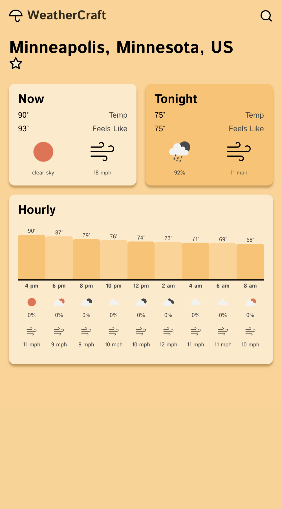
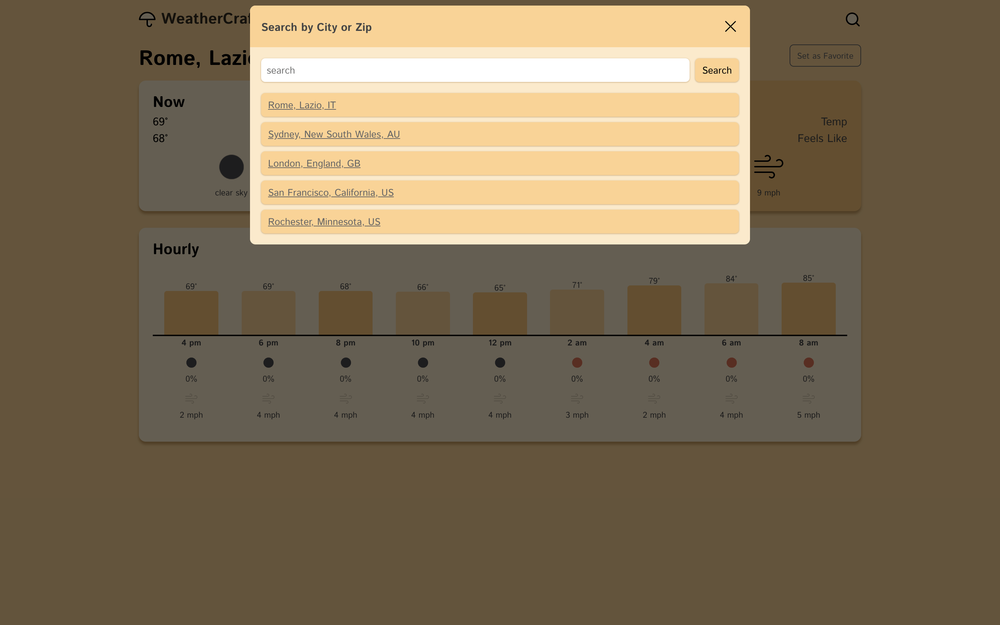

# [WeatherCraft](https://weathercraft-68e93962bfa5.herokuapp.com/) (Rebuild of [Weather Dashboard](https://github/a-down/weather-dashboard))

I built WeatherCraft to update the [Weather Dashboard](https://github/a-down/weather-dashboard) project from my Full-Stack Certificate Profgram. The updates were:
- Express.js backend to handle more complex API calls to the [OpenWeather Weather API](https://openweathermap.org/api)
- UI designed with Figma using a 4pt grid system
- search by zip functionality to allow all users to find any weather for any location
- save location as favorite feature to use as default location
- append and remove elements dynamically
- href params provide arguments for API call
  - users can reload locations
  - users can bookmark locations
  - users can navigate forward/backward in browsing history to see previous pages

## Tech Stack
- JavaScript (jQuery)
- HTML
- CSS
- Node.js
- Express.js
- [GitHub](https://github.com/a-down/weathercraft-jquery-weather-site)
- Heroku Deployment
- [OpenWeather Weather API](https://openweathermap.org/api)
- [Feather Icons](https://feathericons.com/)

## Visuals

## Project Links

[GitHub Repo](https://github.com/a-down/weathercraft-jquery-weather-site)

[Deployed Site](https://weather-craft.onrender.com/)

## Resources

[OpenWeather Weather API](https://openweathermap.org/api)

[Feather Icons](https://feathericons.com/)